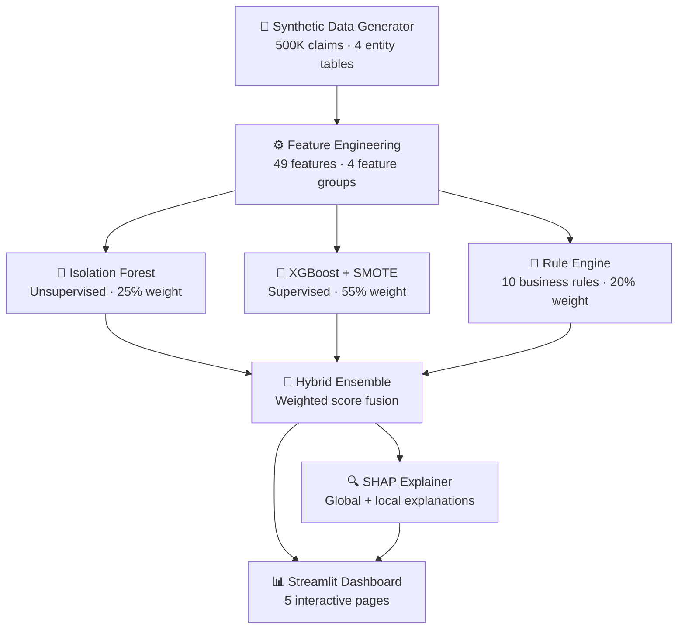

<p align="center">
  
  
  
  
  
  
  
</p>

# 🛡️ ClaimGuard AI

**AI-Powered Pharmacy Claims Anomaly Detection System**

An end-to-end machine learning system that detects fraudulent, wasteful, and abusive (FWA) pharmacy claims using a hybrid ensemble of unsupervised anomaly detection, supervised classification, and domain-expert business rules — with full SHAP explainability and an interactive Streamlit dashboard.

---

## 📋 Table of Contents

- [Problem Statement](#-problem-statement)
- [Solution Architecture](#-solution-architecture)
- [Key Results](#-key-results)
- [Technical Approach](#-technical-approach)
- [Project Structure](#-project-structure)
- [Quick Start](#-quick-start)
- [Tech Stack](#-tech-stack)
- [Domain Insights](#-domain-insights)
- [Future Enhancements](#-future-enhancements)

---

## 🎯 Problem Statement

**Pharmacy fraud costs the U.S. healthcare system over $100 billion annually.** Traditional rule-based detection systems catch only the most obvious patterns and generate excessive false positives, overwhelming Special Investigation Units (SIUs).

### Challenges

| Challenge | Impact |
|-----------|--------|
| **Volume** | Billions of claims processed annually across PBMs |
| **Sophistication** | Fraud rings evolve faster than static rules |
| **Class imbalance** | Fraudulent claims are ~2-5% of total volume |
| **Explainability** | Regulators and SIUs require transparent reasoning |
| **False positives** | Too many alerts → alert fatigue → missed real fraud |

### ClaimGuard AI Addresses These By:

- ✅ **Hybrid ensemble** combining 3 complementary detection approaches
- ✅ **49+ engineered features** capturing behavioral, network, and temporal signals
- ✅ **SHAP explainability** providing per-claim natural language explanations
- ✅ **Interactive dashboard** for SIU investigators and compliance analysts
- ✅ **Realistic synthetic data** mirroring PBM claims adjudication patterns

---

## 🏗️ Solution Architecture



### Data Flow

```
Raw CSVs (claims, pharmacies, prescribers, members)
    │
    ├─→ Claim Features (14): cost ratios, timing, drug signals
    ├─→ Prescriber Features (11): behavioral profiles, peer z-scores
    ├─→ Pharmacy Features (13): dispensing patterns, cost deviations
    └─→ Network Features (11): pair exclusivity, shopping signals
            │
            ├─→ Isolation Forest ──→ anomaly scores
            ├─→ XGBoost (SMOTE) ──→ fraud probabilities
            └─→ Rule Engine ───────→ rule flag counts
                    │
                    └─→ Ensemble Score (0-1) → Risk Tier → SHAP Explanation
```

---

## 📈 Key Results

### Model Performance

| Model | F1 Score | Precision | Recall | ROC-AUC |
|-------|----------|-----------|--------|---------|
| Isolation Forest | 0.432 | 0.340 | 0.593 | 0.861 |
| XGBoost + SMOTE | 0.735 | 0.686 | 0.791 | 0.981 |
| **Ensemble (Hybrid)** | **0.826** | **0.792** | **0.863** | **0.978** |

### Key Metrics

- **826 F1 Score** — 12.4% improvement over XGBoost alone
- **86.3% Recall** — catches 86% of fraudulent claims
- **97.8% ROC-AUC** — near-perfect discrimination ability
- **7 anomaly types** detected across doctor shopping, phantom billing, upcoding, and more
- **<30 seconds** — full pipeline execution on 500K claims
- **73 automated tests** — comprehensive validation suite

### Detection Rate by Anomaly Type

| Anomaly Pattern | Description | Ensemble Detection |
|-----------------|-------------|-------------------|
| Doctor Shopping | Members visiting 5+ prescribers for same drug class | ✅ High |
| Phantom Billing | Claims for non-dispensed medications | ✅ High |
| Quantity Manipulation | Inflated quantities (3-10x typical) | ✅ High |
| Prescriber-Pharmacy Collusion | Exclusive prescriber-pharmacy pairs | ✅ High |
| Upcoding | Brand dispensed, generic billed | ✅ Medium |
| Therapeutic Duplication | Overlapping drugs in same class | ✅ Medium |
| Refill Too Soon | Refill before 75% of days supply consumed | ✅ Medium |

---

## 🧠 Technical Approach

### 1. Synthetic Data Generation

Generates **500,000 realistic pharmacy claims** with 4 entity tables, modeled after real PBM adjudication data (RxClaim, FEP, EDF):

- **53 drugs** across 27 therapeutic classes with realistic NDC codes
- **500 pharmacies** (retail, mail-order, specialty, compounding) with 5-10% suspicious
- **2,000 prescribers** across 15+ specialties with peer-relative behavior
- **10,000 members** with age-appropriate chronic conditions and plan types
- **7 anomaly patterns** injected at 4% rate, mirroring real-world prevalence

### 2. Feature Engineering (49+ Features)

| Feature Group | Count | Examples |
|---------------|-------|----------|
| **Per-Claim** | 14 | `cost_vs_awp_ratio`, `quantity_vs_typical`, `is_after_hours`, `opioid_mme_daily` |
| **Prescriber** | 11 | `presc_controlled_ratio`, `presc_cost_peer_zscore`, `presc_top_pharmacy_pct` |
| **Pharmacy** | 13 | `pharm_controlled_ratio`, `pharm_cost_peer_zscore`, `pharm_unique_prescribers` |
| **Network** | 11 | `doctor_shopping_signal`, `pair_presc_exclusivity`, `pharmacy_shopping_signal` |
| **Rule Engine** | 10+ | `high_quantity_flag`, `high_mme_flag`, `early_refill_flag` |

### 3. Hybrid Ensemble Model

The ensemble combines three complementary approaches:

```
Ensemble Score = 0.25 × IF_score + 0.55 × XGB_prob + 0.20 × Rules_score
```

- **Isolation Forest (25%)**: Catches novel, unseen anomaly patterns without labels
- **XGBoost + SMOTE (55%)**: High-precision supervised detection with class rebalancing
- **Rule Engine (20%)**: Interpretable, threshold-based domain rules from PBM experts

### 4. SHAP Explainability

Every flagged claim gets a **natural language explanation**:

> *"This claim was flagged primarily because the prescriber has an unusually high controlled substance ratio (0.45 vs peer avg 0.12), the prescriber-pharmacy pair shows exclusive routing (87% of this prescriber's claims go to one pharmacy), and the quantity dispensed (360 units) is 8.5x the typical amount for this drug."*

### 5. Interactive Dashboard (5 Pages)

| Page | Description |
|------|-------------|
| 📊 Executive Overview | KPIs, anomaly trends, risk tier distribution |
| 🔍 Claims Explorer | Filterable claims table with drill-down and CSV export |
| 👨‍⚕️ Prescriber Profile | Prescriber search, risk breakdown, peer radar comparison |
| 📉 Model Performance | ROC/PR curves, confusion matrices, model comparison |
| 🧠 Explainability | Global SHAP, per-claim waterfall, what-if analysis |

---

## 📁 Project Structure

```
claimguard-ai/
├── app/                              # Streamlit dashboard
│   ├── streamlit_app.py              # Main entry point (sidebar nav + routing)
│   ├── data_loader.py                # Cached data loading utilities
│   ├── components/
│   │   └── charts.py                 # 14 reusable Plotly chart components
│   └── pages/
│       ├── p01_overview.py           # Executive summary with KPIs
│       ├── p02_claims_explorer.py    # Filterable claims table
│       ├── p03_prescriber_profile.py # Prescriber risk analysis
│       ├── p04_model_performance.py  # ROC/PR curves, confusion matrices
│       └── p05_explainability.py     # SHAP waterfall, NL explanations
│
├── src/                              # Core ML pipeline
│   ├── data_generator/               # Synthetic data generation
│   │   ├── reference_data.py         # 53 drugs, NDCs, pricing
│   │   ├── entities.py               # Pharmacy/prescriber/member generators
│   │   ├── claims.py                 # Claims generation engine
│   │   ├── anomalies.py              # 7 fraud pattern injectors
│   │   └── generator.py              # CLI orchestrator
│   │
│   ├── features/                     # Feature engineering pipeline
│   │   ├── claim_features.py         # 14 per-claim features
│   │   ├── prescriber_features.py    # 11 prescriber behavioral features
│   │   ├── pharmacy_features.py      # 13 pharmacy behavioral features
│   │   └── network_features.py       # 11 network/relationship features
│   │
│   ├── models/                       # ML models
│   │   ├── isolation_forest.py       # Unsupervised anomaly detection
│   │   ├── xgboost_model.py          # Supervised XGBoost + SMOTE
│   │   ├── ensemble.py               # Hybrid weighted ensemble
│   │   └── train_pipeline.py         # End-to-end training pipeline
│   │
│   ├── explainability/               # Model interpretability
│   │   ├── shap_explainer.py         # SHAP global/local explanations
│   │   └── rule_engine.py            # 10 domain business rules
│   │
│   └── utils/
│       └── metrics.py                # Custom evaluation metrics
│
├── tests/                            # pytest test suite (73 tests)
│   ├── test_generator.py             # Data schema, anomaly rates, FK integrity
│   ├── test_features.py              # Feature ranges, no NaN, determinism
│   └── test_models.py                # Model loading, predictions, performance
│
├── notebooks/                        # Jupyter analysis notebooks
│   ├── 01_data_exploration.ipynb     # EDA on 500K claims
│   ├── 02_feature_engineering.ipynb  # Feature distributions and correlations
│   ├── 03_model_training.ipynb       # Model comparison and evaluation
│   └── 04_shap_analysis.ipynb        # SHAP deep-dive visualizations
│
├── docs/                             # Documentation
│   ├── architecture.md               # System architecture with Mermaid diagrams
│   ├── data_dictionary.md            # Field-level data documentation
│   └── anomaly_patterns.md           # Fraud pattern specifications
│
├── data/                             # Data directory (git-ignored)
│   ├── raw/                          # Generated CSV files
│   └── processed/                    # Feature-engineered data
│
├── models/                           # Saved model artifacts (git-ignored)
│
├── requirements.txt                  # Python dependencies with exact versions
└── setup.py                          # Package configuration
```

---

## 🚀 Quick Start

### Prerequisites

- Python 3.11+ (via [Conda](https://docs.conda.io/en/latest/miniconda.html))
- ~500 MB disk space for generated data and models

### 1. Clone and Setup

```bash
git clone https://github.com/Dineshsept20/claimguard-ai.git
cd claimguard-ai

# Create conda environment
conda create -n claimguard python=3.11 -y
conda activate claimguard

# Install dependencies
pip install -r requirements.txt
```

### 2. Generate Synthetic Data

```bash
python -m src.data_generator.generator --num-claims 500000 --output data/raw/
```

Generates 500K claims + 3 entity tables in ~26 seconds.

### 3. Train Models

```bash
python -m src.models.train_pipeline
```

Runs the full pipeline: feature engineering → model training → ensemble scoring → SHAP computation (~75 seconds).

### 4. Run Tests

```bash
pytest tests/ -v
```

All 73 tests should pass.

### 5. Launch Dashboard

```bash
streamlit run app/streamlit_app.py
```

Open [http://localhost:8501](http://localhost:8501) to explore the interactive dashboard.

---

## 🛠️ Tech Stack

| Layer | Technology | Purpose |
|-------|------------|---------|
| **Language** | Python 3.11 | Core development |
| **Data** | pandas 2.3, NumPy 2.3 | Data manipulation |
| **ML** | scikit-learn 1.8, XGBoost 3.2 | Anomaly detection & classification |
| **Imbalance** | imbalanced-learn 0.14 (SMOTE) | Class rebalancing |
| **Explainability** | SHAP 0.50 | Model-agnostic explanations |
| **Visualization** | Plotly 6.5, Matplotlib, Seaborn | Charts and plots |
| **Dashboard** | Streamlit 1.54 | Interactive web UI |
| **Synthetic Data** | Faker 40.4 | Realistic entity generation |
| **Testing** | pytest 9.0 | Automated test suite |
| **Notebooks** | Jupyter | Exploratory analysis |

---

## 💡 Domain Insights

### Why a Hybrid Ensemble?

| Approach | Strength | Weakness |
|----------|----------|----------|
| **Isolation Forest** | Catches novel patterns; no labels needed | Low precision; many false positives |
| **XGBoost** | High precision with labeled data | Misses truly novel fraud patterns |
| **Business Rules** | Transparent; regulatory compliant | Static; can't adapt to new schemes |
| **Ensemble** | **Best of all three** | Slightly more complex to maintain |

### Key Feature Engineering Decisions

1. **Peer z-scores** (e.g., `presc_cost_peer_zscore`): Compare each prescriber/pharmacy against their specialty/type peers, not the entire population. A dermatologist prescribing $500 avg claims is normal; a GP doing the same is suspicious.

2. **Network exclusivity** (e.g., `pair_presc_exclusivity`): If 90% of a prescriber's claims go to one pharmacy, that's a collusion signal. This feature captures it directly.

3. **Doctor shopping signal**: Members visiting 3+ prescribers for controlled substances within a rolling window — a major opioid diversion indicator.

4. **Temporal features** (`is_weekend`, `is_after_hours`): Fraudulent claims are disproportionately submitted during off-hours when oversight is minimal.

### Real-World PBM Context

This system models patterns from real pharmacy benefit management:
- **Drug reference** data mirrors Medispan/First Databank NDC structures
- **DEA schedules** (II-V) track controlled substance prescribing
- **MME (Morphine Milligram Equivalent)** calculations follow CDC opioid guidelines
- **Anomaly patterns** reflect OIG/NHCAA published fraud typologies

---

## 🔮 Future Enhancements

- [ ] **Real-time scoring API** — FastAPI endpoint for live claims adjudication
- [ ] **Graph neural network** — Model prescriber-pharmacy-member networks directly
- [ ] **Temporal modeling** — LSTM/Transformer for sequential claim patterns
- [ ] **Active learning** — SIU feedback loop to improve detection over time
- [ ] **Cloud deployment** — GCP/Azure pipeline with automated retraining
- [ ] **Geographic analysis** — Geospatial clustering of suspicious entities
- [ ] **A/B testing framework** — Compare model versions on live traffic

---

## 👤 Author

**Dinesh** — [GitHub](https://github.com/Dineshsept20)

Built as a portfolio project demonstrating end-to-end ML system design for healthcare fraud detection, from synthetic data generation through explainable AI and interactive visualization.

---

## 📄 License

This project is for educational and portfolio demonstration purposes. All data is synthetic — no real patient, prescriber, or pharmacy information is used.
