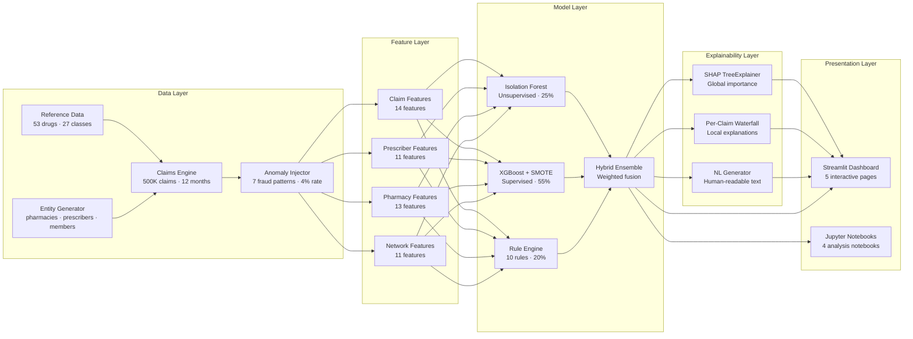
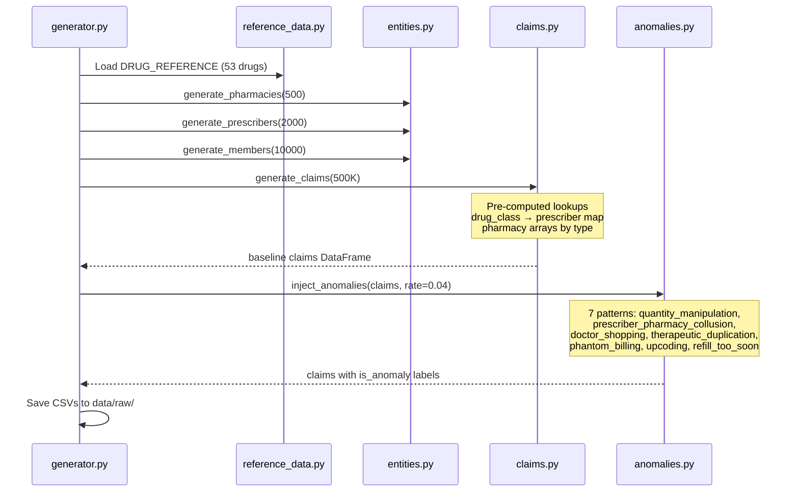
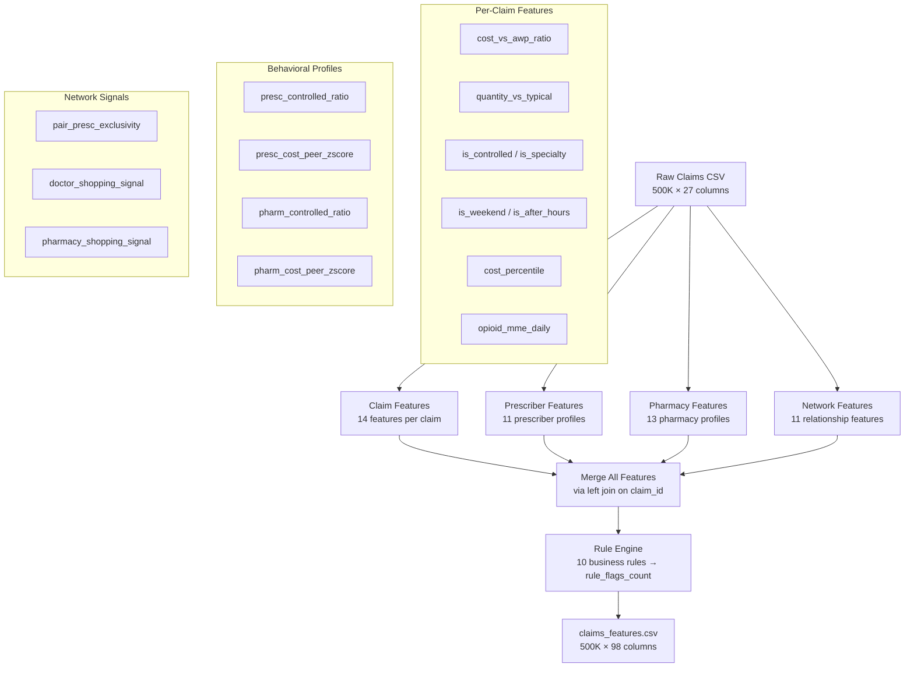
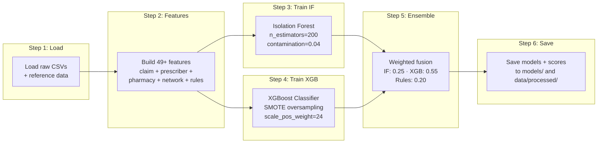
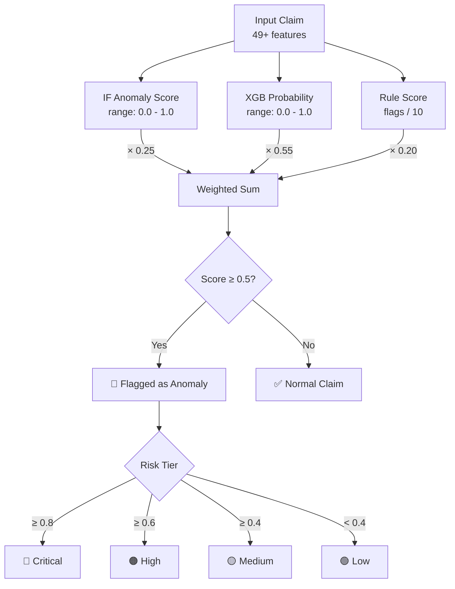
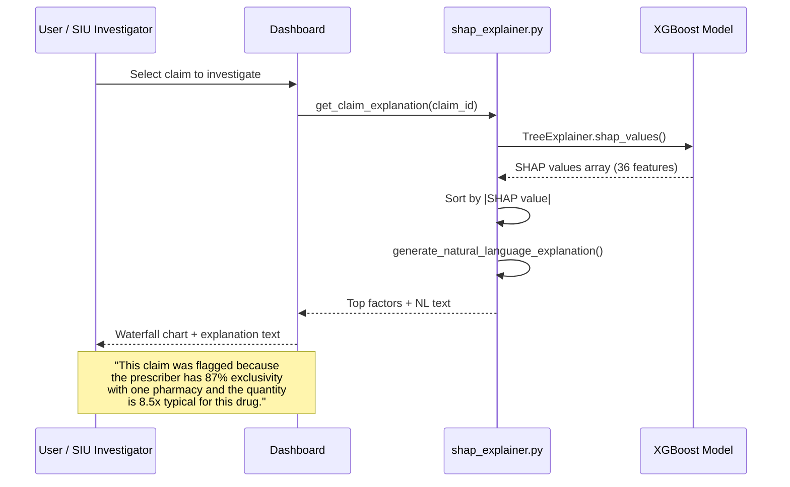
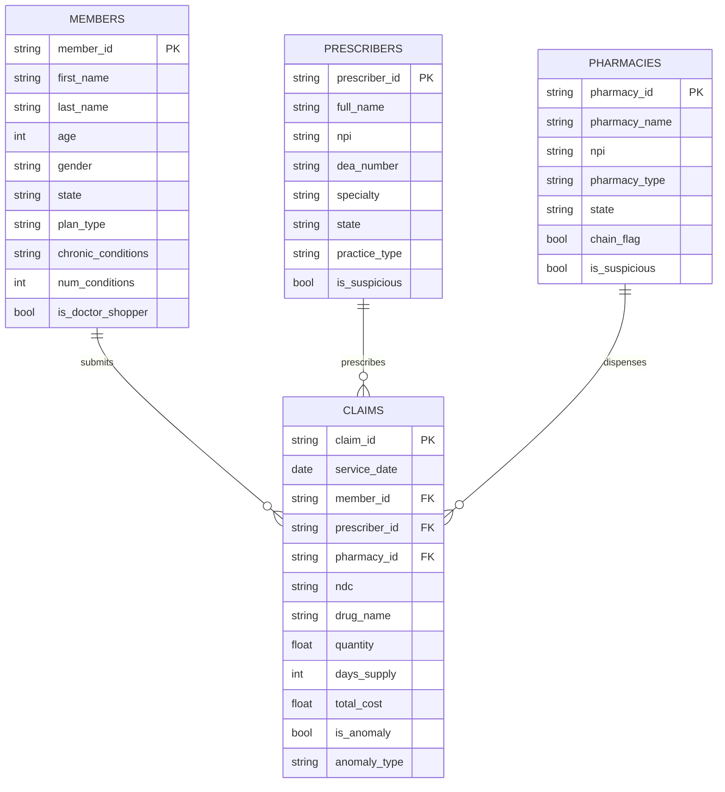

# ClaimGuard AI — System Architecture

## High-Level Architecture



---

## Data Generation Pipeline



---

## Feature Engineering Pipeline



---

## Model Training Pipeline



---

## Ensemble Scoring



---

## Dashboard Architecture

```mermaid
graph TD
    APP[streamlit_app.py<br/>Main entry point] --> NAV[Sidebar Navigation<br/>Radio button routing]

    NAV --> P1[p01_overview.py<br/>Executive KPIs]
    NAV --> P2[p02_claims_explorer.py<br/>Filterable claims table]
    NAV --> P3[p03_prescriber_profile.py<br/>Prescriber risk analysis]
    NAV --> P4[p04_model_performance.py<br/>ROC/PR curves]
    NAV --> P5[p05_explainability.py<br/>SHAP explanations]

    DL[data_loader.py<br/>@st.cache_data] --> P1 & P2 & P3 & P4 & P5
    CH[charts.py<br/>14 Plotly components] --> P1 & P2 & P3 & P4 & P5

    subgraph "Cached Data Sources"
        D1[claims_scored.csv]
        D2[claims_features.csv]
        D3[pharmacies.csv]
        D4[prescribers.csv]
        D5[xgboost_model.pkl]
        D6[shap_values.pkl]
    end

    DL --> D1 & D2 & D3 & D4 & D5 & D6
```

---

## SHAP Explainability Flow



---

## Data Model (Entity Relationships)


